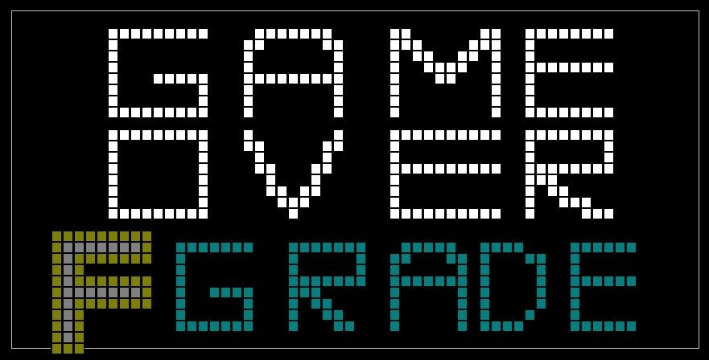

# < 18-2 "SW Basic Design" Project >

## 퍼즐 & 미로 게임 "땡이의 F 피하기"

- 2018년 2학기(2학년 2학기) 'SW설계기초' 과목 콘솔 게임 제작 프로젝트 
- C, C++를 이용한 `퍼즐 & 미로 탈출` 게임

 

## 팀원

|이름|역할|
|---|---|
|<a href="https://github.com/woogie-s">신현욱</a>|💻 Develop(Map, NPC) |
|<a href="https://github.com/ghis22130">김지수</a>|💻 Develop(Item) |
|<a href="https://github.com/jeonbar2">강전호</a>|💻 Develop(Puzzle) |

 

## 게임 스토리
1. 1학년 통째로 신나게 노느라 학사경고를 2번이나 받은 우리의 주인공 `땡이` 학생은 군대를 다녀온 후 제대로 마음 먹고 복학을 하였다.
2. 세 번의 학사 경고는 바로 `제적 !!`
3. 하지만 통학하는데 걸리는 시간은 무려 두시간 이상! 한번 더 결석을 하게 된다면 또 한번 학사 경고를 받을 위기에 놓인 `땡이` 학생은 험난한 등교길에 나선다.
4. `버스, 지하철` 등을 이용하여 등교해야 하지만, 그 길은... 쉽지만은 않다.
5. 주변 곳곳에 있는 각종 `장애물들`을 넘어 위기의 주인공 땡이를 제한 시간 내에 대중 교통에 탑승시켜 학사 경고를 면해보자!

 
자세한 내용은 <a href="/Documents">이 곳</a>의 문서들을 통해 확인하실 수 있습니다.

또한, 게임 구현 코드는 <a href="/AvoidFgrade">여기</a>에서 확인하실 수 있습니다.

 

<table style="text-align:center;">
    <tr>
        <th>상세 화면</th>
    </tr>
    <tr>
        <td>
        
         ▲ 첫번째 스테이지 화면
        </td>
    </tr>
    <tr>
        <td>
        
         ▲ 스테이지 클리어 화면
        </td>
    </tr>
    <tr>
        <td>
        
         ▲ 두번째 스테이지 화면
        </td>
    </tr>
    <tr>
        <td>
        
         ▲ 게임 오버 화면
        </td>
    </tr>
    <tr>
        <td>
        
         ▲ 게임 클리어 화면
        </td>
    </tr>

</table>